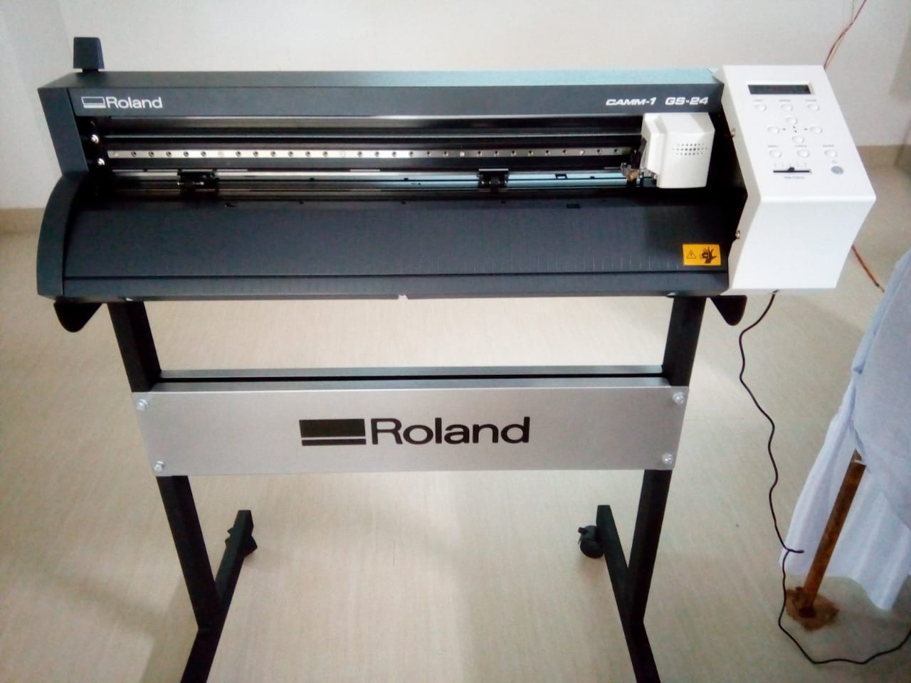
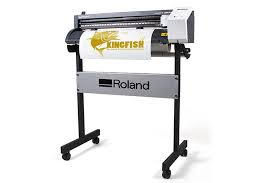

## Vinyl Cutter

In this machine, the vinyl sheet should be kept within the white mark length.
Each side atleast 2mm space should be kept.
The side margine of the sheet should be in the level of machine marked level.
This machine installed in "FabLab" is Make "Roland" model "CAMM 1 GS-24".
With a completely redesigned cutting carriage and blade holder, the GS-24 offers great stability, up to 10x overlap cutting and down force of up to 350 grams so that you can cut like never before — even on thick, dense substrates. The GS-24 is Roland's best desktop cutter ever.

To print any text or object and to edit that text or object, "InkScape" software has been downloaded. The selected text or object has be placed in the "Inkscape" software. After editing, the file has to save in ".png" format. Then the saved .png file has to put in Vinyl Cutting Machine and cutting would be started as per save design.

