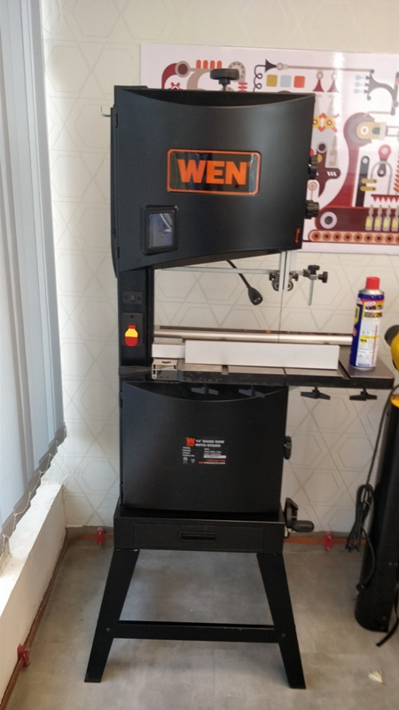

## Equipments Installed in FabLab

Today I have seen different types machine as follows: 
## Band Saw Cutter

## CNC Machine

## Ink Jet Printer

## Laser Cutter Filter

## Laser Cutter Machine

## Scroll Saw Cutter 

## Stereo Lathhography Printer

