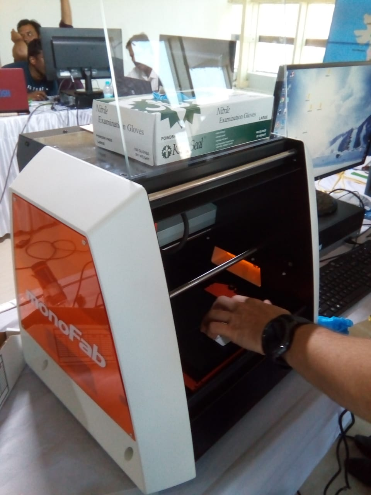
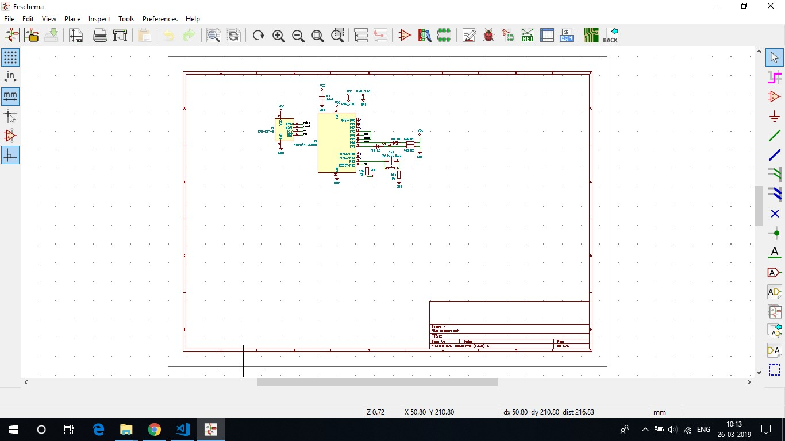
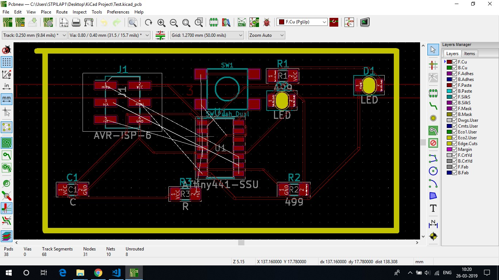
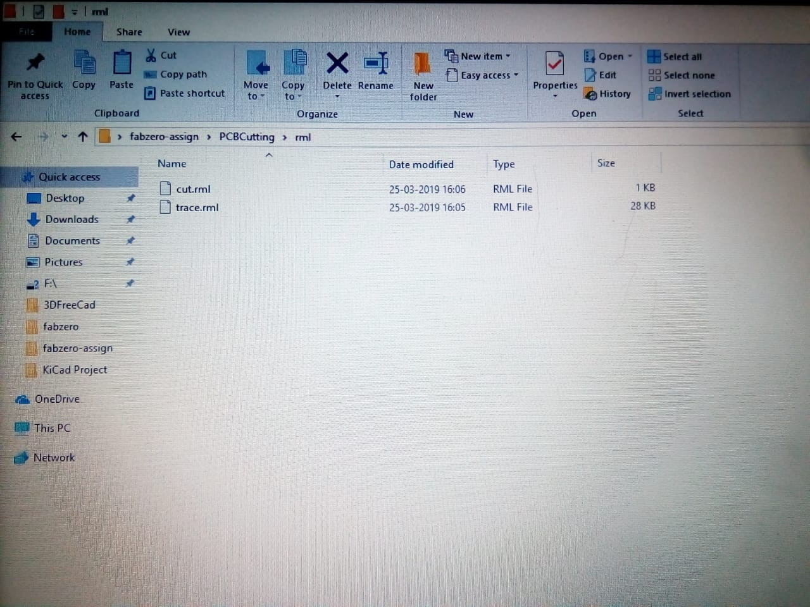
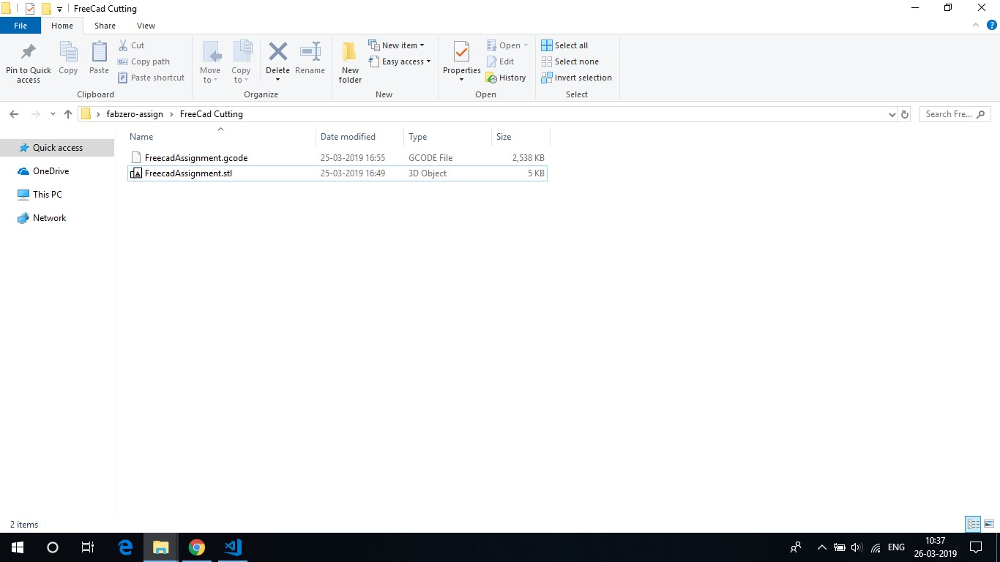
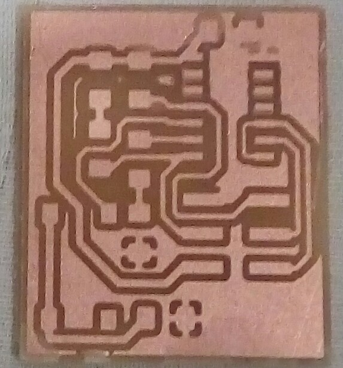
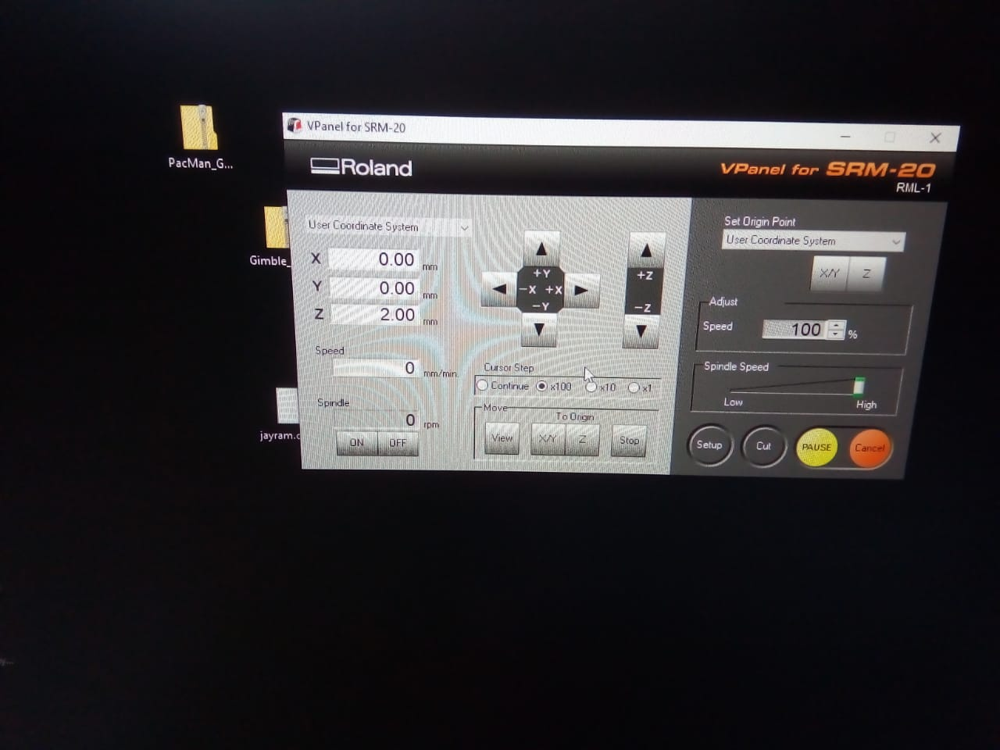
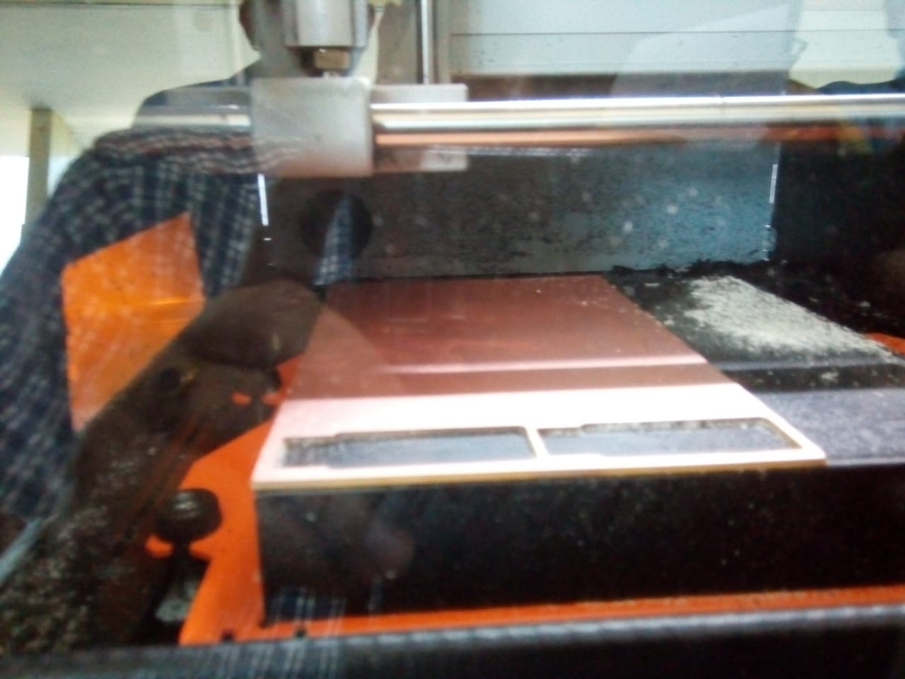
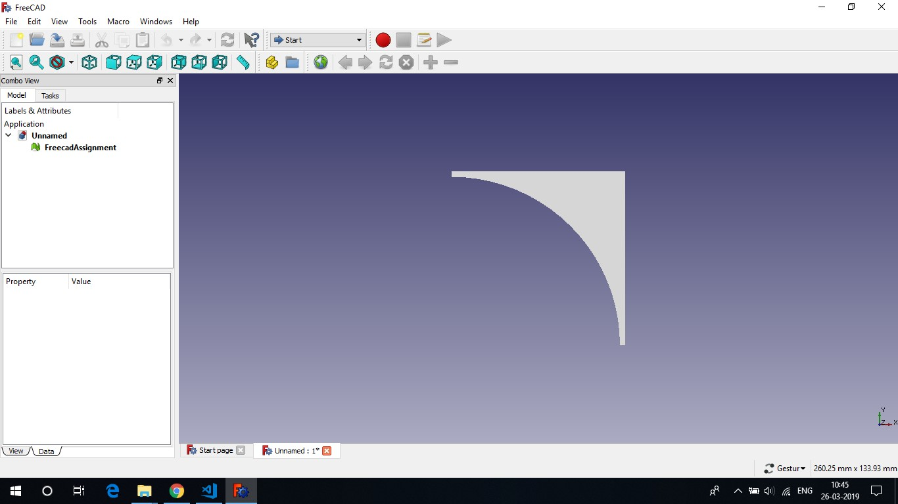
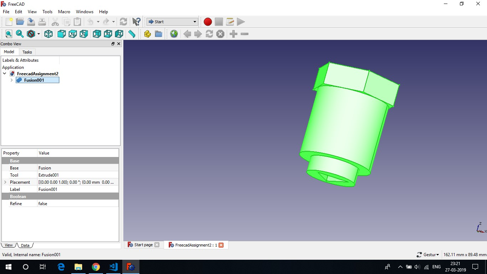

## MonoFab CNC Machine

It is also called Desktop Milling Machine.
With the SRM-20 3D milling machine, 3D data can be shaped into solid objects with exceptional precision. Capable of milling a wide range of materials, the SRM-20 is invaluable for industrial design prototypes, industrial parts, educational tools.
The SRM-20 portable milling machine can mill a broad range of materials, including modeling wax, chemical wood, foam, acrylic, poly acetate, ABS and PCB board. The following items are just some of the prototypes and applications made possible:

Product inventions
Wax molds for casting
Tools and machinery
Relief plaques and graphics Vehicle prototypes
Game and model parts.

## Experiment: 

## Prototyping

First We have to download & install "Kicad 5.1.0" software.
By the schematic diagram, we may understand the function of each pin of the microprocessor.
SOIC stands for Surface mount chip and PDIP stand for upmount the mount the chip.
After opening KICAD, make new project folder (name) and save it.  All the project files have to save in this folder.
Press Ctrl + Delete + Edit, it open "Libraries" then choose "Tinny 441-ssu" which is the microprocessor having different pins.
Then from "Place symbol" option select "Tinny44" ckt. Then search & select Vcc, GND, LED, Resistor etc. as per requirment of the microprocessor.
Click on the  component's symbol and press "R" to rotate , press "M" to move the peripherals.
Select "Place Wire" option to draw the wire. press "W" to start to draw the wire and "K" to end.
Select "A" option to write name of any component and select the component, then press "Ctrl + v" to put the value of the component.
After completion of drawing of the ckt., click on "Annotate Schematic Symbol", then click on "Perform Electrical Rules Check" and then "Run".
You may found different types of connection error  and have to correct these as per the error instructions.
After final completion with any error, click on "Footprint" option. Then select every Resistor, LED etc. 
Click on "Generate Netlist" and save it as ".net" format. Example: "Test.net".

## PCB Designing

Now to design new PCB board, click on "PCBnew" option. Click on "Net" option  and select "Test.net" which was already saved.
Click on "updatepcb" button to update any specific component.
Then select "Route Track" optionand drag the route track line as per the white lines of the ckt.

Every changes have to save in "KiCad Project" folder.
Click on "Assign PCB Foot Print", select "Preference", click on "Manage FootPrint Libraries", click on "project Specific Libraries". This will show "Active (Tick)", Library path, plugin type (kicad).

 

## PCB Cutting

After final circuit designing, open "FreeCad".
Click on "Edge.cats. Then click on Triangle mark and then click on "Add Graphic Line".
Now draw yellow lines by clicking every angle to creat a box. Each line size is .08mm.
From "File" select "plot", select "SVG", select only "F.Cu" and "Edge.cuts". Then from "General Option" select "Exclude pads from silk screen", "Negetive plot", "Check Zone and "all". Then click on "Plot".
It will save ".svg" file in "KiCad Project" folder, then open "Inkscape" choose that file & open.
Then click on "Export PNG image".
Select the circuit image in ".svg" file by pressing "Shift + Pointer" and then save.

Now, download "Trace" and "Cut" file. Then convert both files into ".rml" format.
Select "Input Format", select ".png" image.
Select "Output Format" select "Roland Mill (.rml)" (.camm), click on "Process (1/64), then select "dpi=2000", select machine "SRM 20", select speed "4". 
Save the "GCode" of the image.
Now click on "Calculate" and save it in "KiCad Project" folder.
Save the final image in ".stl" format and put it to "Sindoh" to print.

## Steps for the cutting of PCB by MonoFab CNC

Download "Vpanel" software to operate the SRM-20 to cut the PCB.
Select Trace = 1/64 and cut = 1/32.
For trace, select X axis = 0, Y axis = 0. Now take Z axis to the origin.
Now loose the drilling nidle & pull down to the surface of the pcb board and again tight align key.
Now make Z axis = 0.
Now select "Machine Cordinate System" and  note down X & y axis origin value and take Z axis position 02mm. upward from the PCB bpard.
Now select "Cut" option and select the "Trace.rml" file.
Then click on "Output".

For "Cut" pcb board, click on "xy" option to go back original potion which we set before.
And adjust Z axis as before process and cut then click on "Output".

## FreeCad

Download the "FreeCad".
Select "Cylinder"  then from "Creation of Parametrized Geometric Primitives" select "Regular Polygon".
Select the sizes of the cylinders and triangle.
Select "Extrude" and then select "Along Normal".
Then select "shapes and "Difference" and apply.
Now, to save from "File", select "Export", select the image and select ".stl" formate.
To save it's "Gcode", open sindoh software.
Load in Sindoh by selecting that ".stl" image.
Now, from Sindoh, select File, Selct " Save Gcode" of that image and save it in "FreeCad" folder.

 

