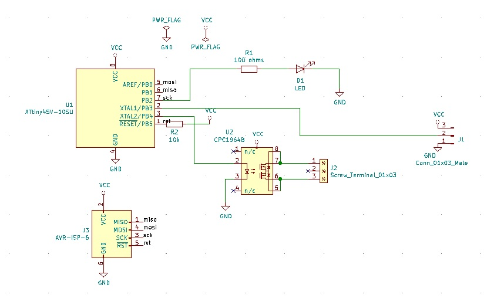
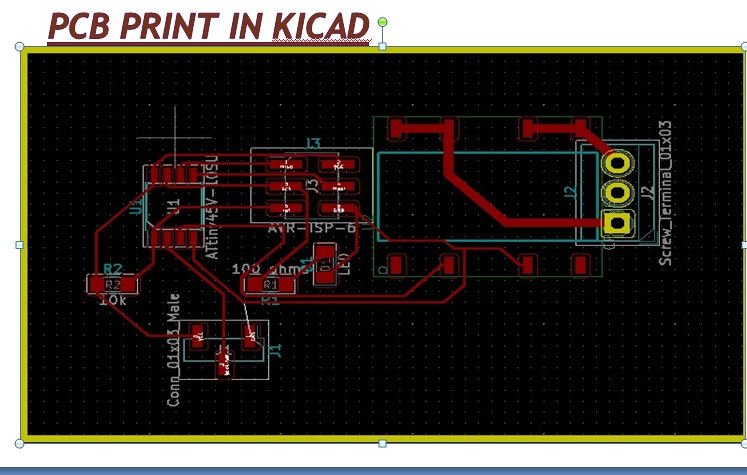
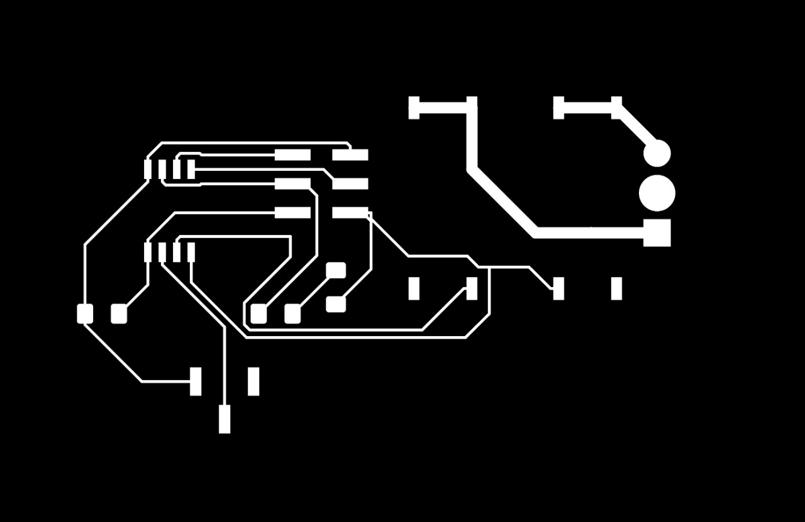
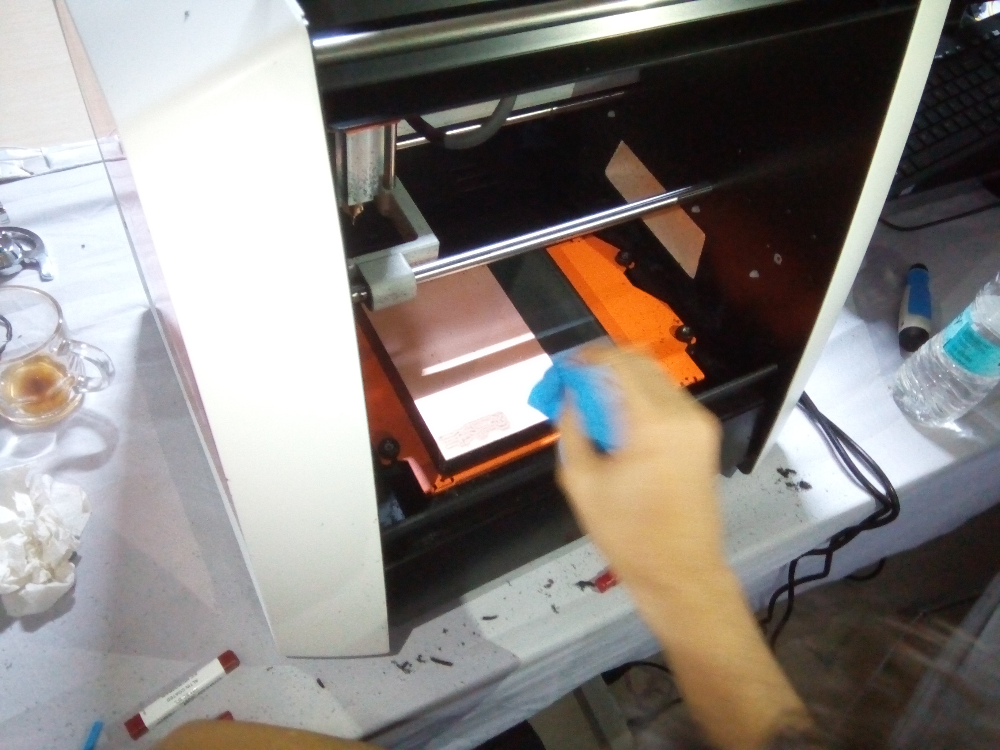
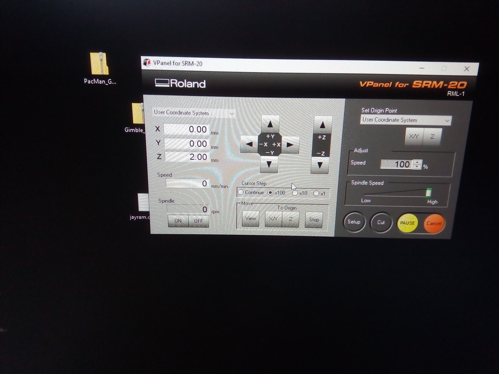
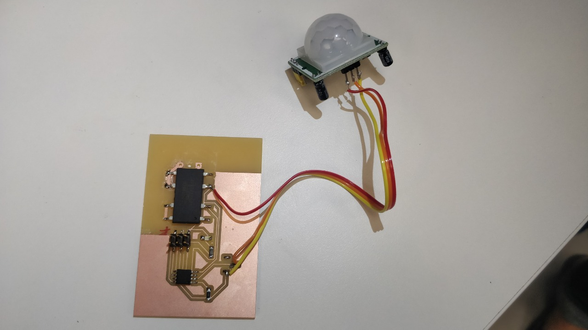
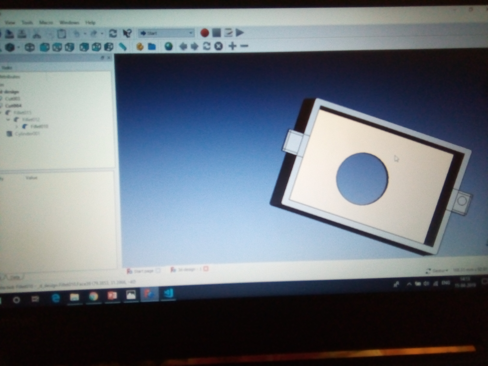
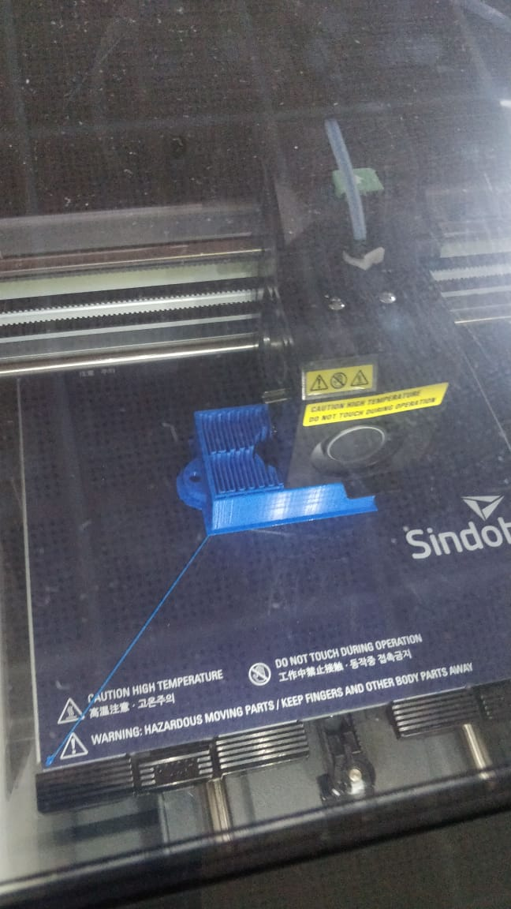
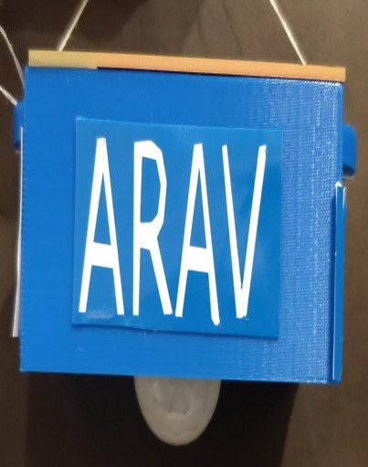

## Automatic Room Lighting System

Objective of the project:

1. The objective of this project is to make an Automated Room Lighting System which can automatically turn ON the lights by detecting the presence of human and turn OFF the light when no human presence is detected.

2. This project is useful since it aims towards conservation of energy which is most important.

3. The product would be useful in the those areas which require lights only when it is in use for eg: Staircase area, washrooms etc.

Components used in the project:

Micro-controller- At tiny-45 10 SU- 1no.

ISP Header – 1 no.

PIR Sensor – 1 no.

100 ohm resistor- 1 no.

10 K resistor- 1no.

LED- 1 no.

1 x 3 male Connector- 1no.

Solid State Relay- 1no.

## Working on the project:

We prepared the schematic diagram of the circuit as per the pin connection of AT tiny-45 10SU data sheet along with above listed components through the KiCad.

The above schematic diagram was converted to PCB print to design the pin connection through KiCad and connected the pins of the components as per the schematic diagram.

Then we made the Trace and Cut ".png" file of the above PCB design and converted into ".rml" file through www.fabmodule.org.

Now we placed the one side PCB in the "MonoFab - SRM-20" CNC machine and set the 64mm drilling bit to cut the Trace file after setting of "XY" and "Z" axis which is as per the circuit diagram.

After cutting the trace file, we again set the another 32mm drilling bit to cut the Cut file which cut the outer portion of the main circuit board.

After made Trace and cut on the PCB, we soldered the required components as per the schematic diagram.

Now, we made a suitable box with the hanging system and a mid hole to fit the PIR Sensor inside the box.
The box was designed by "FreeCad" software by taking hight, width, length of the circuit board and the radius, diameter of the sensor to fit it in side mid hole of the box. After drawing the suitable box in "FreeCad", we saved that file in ".stl" format then we loaded it in "Sindoh" software for 3D Printing.

Then we prepared two tages named "FABLAB" and "ARAV". The texts were written in "Inkscape" software. After editing, the file has to save in ".png" format. Open https://mods.cba.mit.edu and write click any where, the click on "Program" then click on "Open Sever Program". Then select the machine "Vinyl Cutter GX-24 cut png". A circuit will appear. Then select ".png" file which was already selected. Make speed (cm/s)=20. Then connect I/p and O/p. It will calculate and make a line between I/p and O/p. To select the 'width' & 'Hight' of the text, click on "file" option & select "Document Properties". Now, send the save ".camm" file to print it in Vinyl cutter machine. Then, we pasted the tags on the 3D printed box.

Finally, we placed the PCB alingwith the PIR sensor inside that box and fixed it with the gum.

