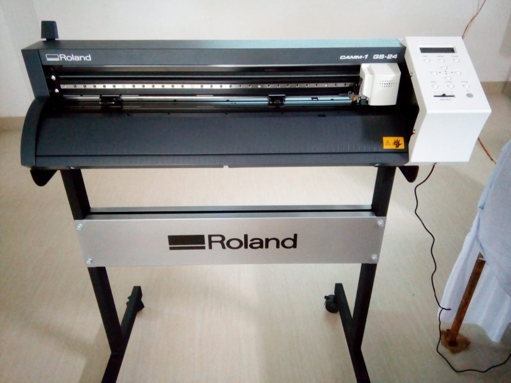
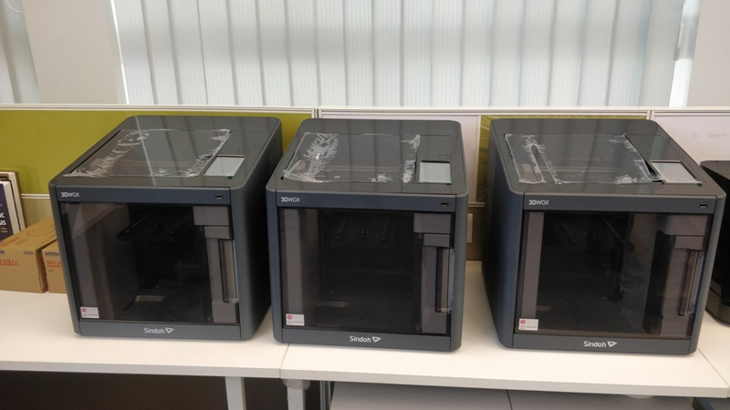

******** DAY - 1 (18.03.2019) ******

 Hi, I am Suvadip Barua from STPI-Kolkata
I visited fab lab Bhubaneswar on 18.03.2019 and had seen equipment installed in fabrication lab. 
Listen the primary demo of different CNC (Computer Numerical Control") machines like Band Saw Cutter,Scroll Saw. 
There are Small CNC Machine like SRM-2 (DG Shape) model. 
The Shopbot CNC machine is 3 axis machine. It's size is 96" x 48". It is used to fabricate preferably wood, alluminium. It's cutting length is 12".
The Saw cutter make WEN is the big hacksaw blade.
The Scroll saw cutter is the thin hacksaw blade and the material we may move any direction for perfact cutting.
The Band & Scroll Saw both are 3D cutter.
There is a High pressure water cleaner which is used to clean the materials cutting to remove the dust.
The Small CNC machine model SRM - 2 make DG Shape  is used for small thin materials preferably PCB. It is 3D cutting CNC machine.
There is Vinyl cutter model CAMM - 1, GS24, make Ronald. This is 2 axis machine. It is used to the vinyl materials. To cut the vinyl materials, the max. force i.e. weight on the machine is 80gm.  
There is Laser cutter of Epilog Laser, Fussion M2. It is a 3 axis cutting machine. The laser ray formulation based on CO2. It is uesd to cut soft materials like wood, plastic. It is 80 W machine.
There is a Filttering machine of PureX. It is used extract the gases and micro particles which is produced during the cutting.
There is a 3D printer of model 3DWOX, make Sindoh. It is Fused Filament diposion. The plastic materials liquified and when printing going on, the material getting hard.
There is Formlabs 3D printer. It is stereo lethography. Using resin, the UV ray make chemical reaction.
The is injet 3D printer. It is a 2 axis machine for simple 3D printing.

******* DAY 2 (19.03.2019) ******
I downloaded Inkscape and cura software for configuring the 3D printing.
Then downloaded "Windows - Git" then press control + shift + P.
Then ">git:clone ........" will appear.
Then copy the URL from "www.github.com/9406012766/Suvadip" from "clone with HTTPS" option.
And past the above URL in Visual Studio Code software to upload the day to day work documents.
To making any changes/ corrections in the datasheet of Visual Studeo Code, after making the changes/ correction, a massage will appear in "Source Control" the save it by clicking Control + S.
After saving the corrections, another massage will arrear to commit. Write the any commit name. Exam: "Test". After that click on "Tick" mark.
Then from the .....(dotted) option click on "Push".
Whenever click on "Push" button "Git Bash" window will be opened. 
In "Git Bash" window, write the command "git config --global user.email "suvadip.barua@stpi.in"
and also write command "git config --global user name "Suvadip Barua".
Then refresh the web page "https://github.com/9406012766/fabzero". "fabzero" is the document folder in the computer.
To see the day to day work contribution of each person, open the web page "https://github.com/9406012766", then a daily contribution graph will graph will appear of that user.
To upload the Image, first save the specific image in .jpg format in the "Fabzero" folder.
Then that image name will appear in "Visual Studeo Code" software. The write the command ".
Then in the same above process have to push the image in the web site "https://github.com/9406012766/fabzero" and refresh the web site to see the update effect.
## Vinyl Cutter

In this machine, the vinyl sheet should be kept within the white mark length.
Each side atleast 2mm space should be kept.
The side margine of the sheet should be in the level of machine marked level.
This machine Make "Roland" model "CAMM 1 GS-24".
## Sindoh 3D Printer

The Sindoh 3D Printer Model is 3D WOX.
There are Four option in the touch screen of the printer i.e. Print, Cartidge, Setting and Info.
There are two cooling fan inside this printer.
In this machine, Input option is to input pendrive or other input sources having the image which have to 3D print .
By pressing Unload option, the temparature of the Filament/ cartidge goes down and the filament will auto metically remove through the filament/ cartidge pipe.
Then the filament/ cartidge can be removed from the casing.
The filament / cartidge diameter is 1.75mm.
There is a Chip (Intregated Circuit) which helps this machine to identify the lenght, color & physical property of the material which have to print.
The Filament/ Cartidge is made of "Poly Lactic Acide (PLA)". 