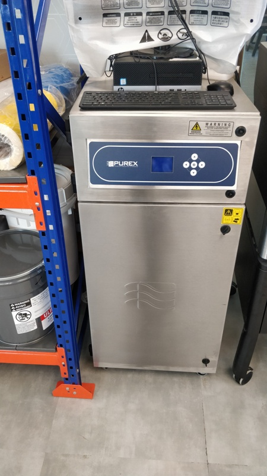

## Self Introduction

[introduction](Introduction.md)

## Day 1

Today I have seen different types machine as follows: 
## Band Saw Cutter

## CNC Machine

## Ink Jet Printer

## Laser Cutter Filter

## Laser Cutter Machine

## Scroll Saw Cutter 

## Stereo Lathhography Printer

## ******* DAY 2 (19.03.2019) ******
I downloaded Inkscape and cura software for configuring the 3D printing.
Then downloaded "Windows - Git" then press control + shift + P.
Then ">git:clone ........" will appear.
Then copy the URL from "www.github.com/9406012766/Suvadip" from "clone with HTTPS" option.
And past the above URL in Visual Studio Code software to upload the day to day work documents.
To making any changes/ corrections in the datasheet of Visual Studeo Code, after making the changes/ correction, a massage will appear in "Source Control" the save it by clicking Control + S.
After saving the corrections, another massage will arrear to commit. Write the any commit name. Exam: "Test". After that click on "Tick" mark.
Then from the .....(dotted) option click on "Push".
Whenever click on "Push" button "Git Bash" window will be opened. 
In "Git Bash" window, write the command "git config --global user.email "suvadip.barua@stpi.in"
and also write command "git config --global user name "Suvadip Barua".
Then refresh the web page "https://github.com/9406012766/fabzero". "fabzero" is the document folder in the computer.
To see the day to day work contribution of each person, open the web page "https://github.com/9406012766", then a daily contribution graph will graph will appear of that user.
To upload the Image, first save the specific image in .jpg format in the "Fabzero" folder.
Then that image name will appear in "Visual Studeo Code" software. The write the command ".
Then in the same above process have to push the image in the web site "https://github.com/9406012766/fabzero" and refresh the web site to see the update effect.
## Vinyl Cutter

In this machine, the vinyl sheet should be kept within the white mark length.
Each side atleast 2mm space should be kept.
The side margine of the sheet should be in the level of machine marked level.
This machine Make "Roland" model "CAMM 1 GS-24".
## Sindoh 3D Printer

The Sindoh 3D Printer Model is 3D WOX.
There are Four option in the touch screen of the printer i.e. Print, Cartidge, Setting and Info.
There are two cooling fan inside this printer.
In this machine, Input option is to input pendrive or other input sources having the image which have to 3D print .
By pressing Unload option, the temparature of the Filament/ cartidge goes down and the filament will auto metically remove through the filament/ cartidge pipe.
Then the filament/ cartidge can be removed from the casing.
The filament / cartidge diameter is 1.75mm.
There is a Chip (Intregated Circuit) which helps this machine to identify the lenght, color & physical property of the material which have to print.
The Filament/ Cartidge is made of "Poly Lactic Acide (PLA)". 
## Sindoh Printout 3D Model

The febricated loose end must be tight with clip of this 3D printer