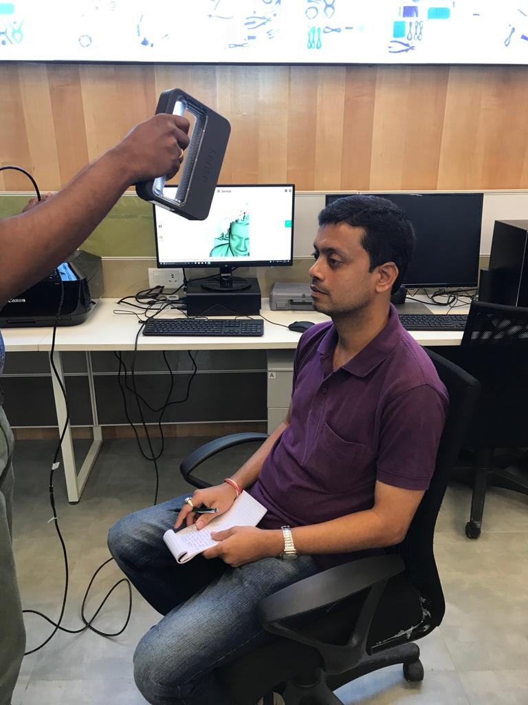
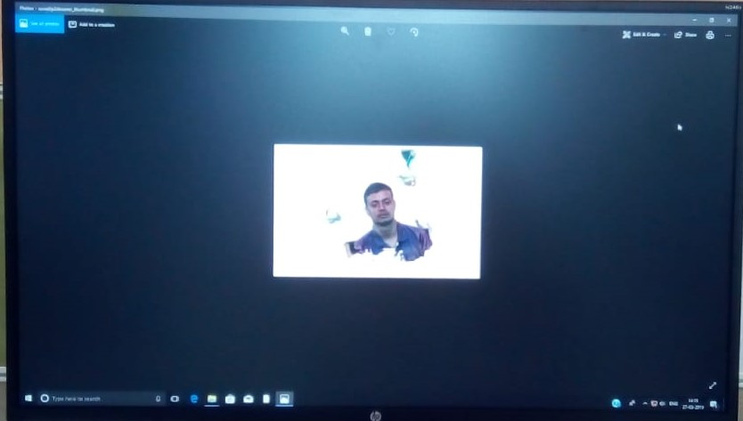

## Sense 3D Scanner

It is a 3D Scanner.
Download the "3D System Sense" software and install it.
Choose the "Object, "Head" or "Body" option for the software.
Then click on "Scan" option by selecting "Head".
Now move the Scanner slowly arround the head.
After full scanning, edit the image by "Earase" or "Trim" option.
After final completion, click on "Finish" and save it in ".slt" format.
Now, that ".stl" image may print by loading in "Sindoh software".

 "Scanning Image"

