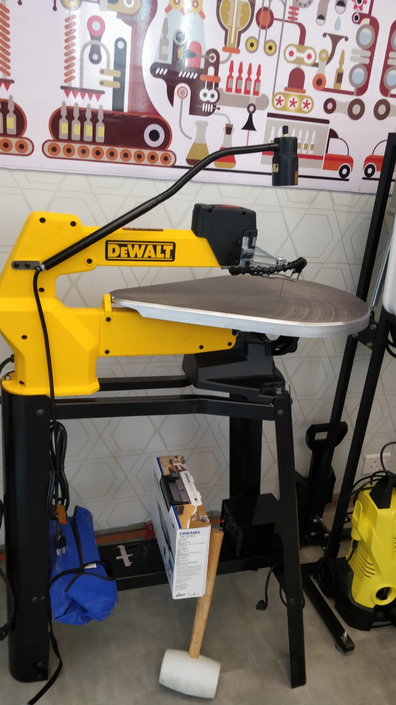

## Scroll Saw Cutter Machine

The blades may be changed in a few seconds and setting the tension on them is simple as the control is placed right in front. Having the flexibility of moving your project around to get the right angle is a plus point. And this scroll saw is a perfect fit since it provides you with a movable top arm. This allows you to get your project on and off the table with ease.

A very steady workspace is what you get from this machine as the forward and the rear blades are immovable. Your wood will never burn and you can get your cutting done slowly with precision. The blades of a Dewalt scroll saw will have a longer life span giving you a long term benefit.
Arm lifts so blade can be easily threaded through the material for inside cuts.