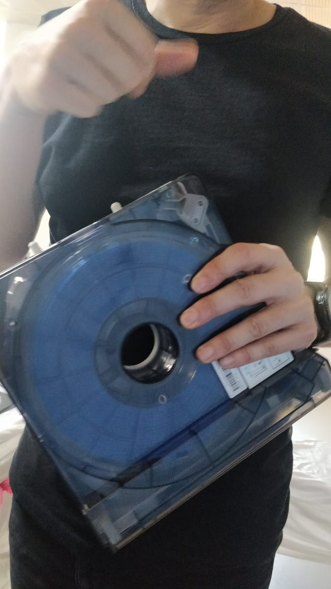

## Sindoh 3D Printer

The Sindoh 3D Printer Model is 3D WOX.
There are Four option in the touch screen of the printer i.e. Print, Cartidge, Setting and Info.
There are two cooling fan inside this printer.
In this machine, Input option is to input pendrive or other input sources having the image which have to 3D print .
By pressing Unload option, the temparature of the Filament/ cartidge goes down and the filament will auto metically remove through the filament/ cartidge pipe.
Then the filament/ cartidge can be removed from the casing.
The filament / cartidge diameter is 1.75mm.
There is a Chip (Intregated Circuit) which helps this machine to identify the lenght, color & physical property of the material which have to print.
The Filament/ Cartidge is made of "Poly Lactic Acide (PLA)". 
"3D WOX" Sindoh software has to be downloaded and from "www.thingiverse.com" select  & save the pic. which have to 3D print.
Then load that pic through "3D WOX" Sindoh software.

I printed an image downloaded from www.thingiverse.com

## Sindoh Printout 3D Model

The febricated loose end must be tight with clip of this 3D printer

## Making a Object in "FreeCad"

Download and install "FreeCad".
Open FreeCad and click on File option click on "New".
Select "Part", click on "Box" mark, click on "Set to Axonometice View".
Then maximise the screen, in the buttom right side click on "Gester", so we can move the object by clicking the mouse on it.
There are three axis like x,y, z.
Then click on "Model", click on "Cube" & put the lenght, height and width of the object.
Select again select another object like "Cylinder". Also put the lenght, height and width of the object.
Now, click on "Run a Boolean Operation" with two shapes selected".
To save the final image, click on "File", select "Export", select "STL.Mesh". This will save the file in ".stl" format.