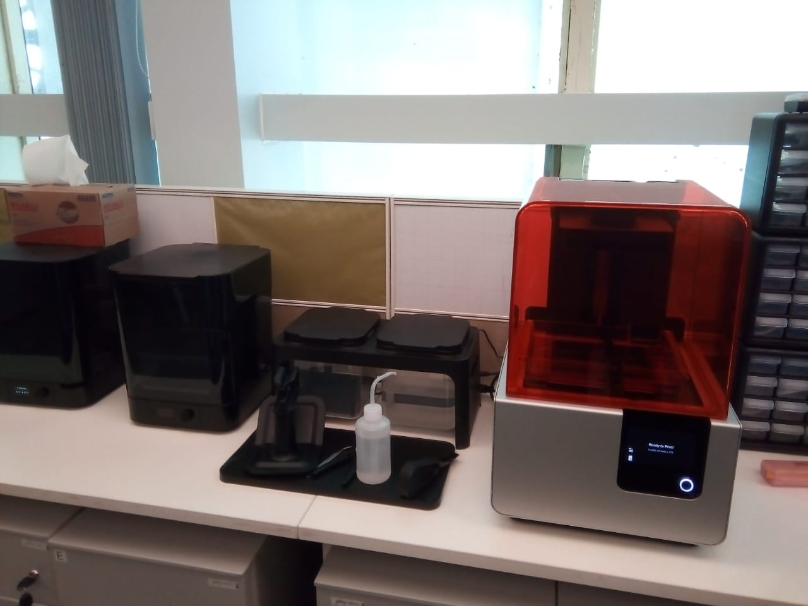

## Stereo Lathography 3D Printer

Stereolithography (SLA) is an additive manufacturing - commonly referred to as 3D printing - technology that converts liquid materials into solid parts, layer by layer, by selectively curing them using a light source in a process called photopolymerization. Stereolithography (SLA) is widely used to create models, prototypes, patterns, and production parts for a range of industries.

