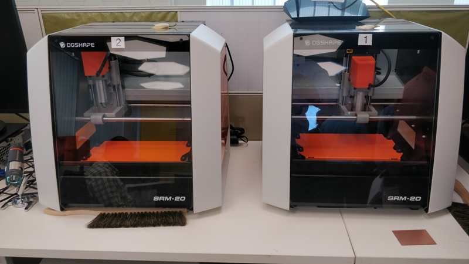

## Stereo Lithography 3D Printer

It is also called Desktop Milling Machine.
With the SRM-20 3D milling machine, 3D data can be shaped into solid objects with exceptional precision. Capable of milling a wide range of materials, the SRM-20 is invaluable for industrial design prototypes, industrial parts, educational tools.
The SRM-20 portable milling machine can mill a broad range of materials, including modeling wax, chemical wood, foam, acrylic, poly acetate, ABS and PCB board. The following items are just some of the prototypes and applications made possible:

Product inventions
Wax molds for casting
Tools and machinery
Relief plaques and graphics Vehicle prototypes
Game and model parts.

## Experiment: 

## Prototyping

First We have to download & install "Kicad 5.1.0" software.
By the schematic diagram, we may understand the function of each pin of the microprocessor.
SOIC stands for Surface mount chip and PDIP stand for upmount the mount the chip.
After opening KICAD, make new project folder (name) and save it.  All the project files have to save in this folder.
Press Ctrl + Delete + Edit, it open "Libraries" then choose "Tinny 441-ssu" which is the microprocessor having different pins.
Then from "Place symbol" option select "Tinny44" ckt. Then search & select Vcc, GND, LED, Resistor etc. as per requirment of the microprocessor.
Click on the  component's symbol and press "R" to rotate , press "M" to move the peripherals.
Select "Place Wire" option to draw the wire. press "W" to start to draw the wire and "K" to end.
Select "A" option to write name of any component and select the component, then press "Ctrl + v" to put the value of the component.
After completion of drawing of the ckt., click on "Annotate Schematic Symbol", then click on "Perform Electrical Rules Check" and then "Run".
You may found different types of connection error  and have to correct these as per the error instructions.
After final completion with any error, click on "Footprint" option. Then select every Resistor, LED etc. 
Click on "Generate Netlist" and save it as ".net" format. Example: "Test.net".
Now to design new PCB board, click on "PCBnew" option. Click on "Net" option  and select "Test.net" which was already saved.
Click on "updatepcb" button to update any specific component.
Then select "Route Track" optionand drag the route track line as per the white lines of the ckt.

Download "fab.pretty" & save in "KiCad Project" folder.
Click on "Assign PCB Foot Print", select "Preference", click on "Manage FootPrint Libraries", click on "project Specific Libraries", click on "Folder" to select "Feb.Pretty". This will show "Active (Tick)", Library path, plugin type (kicad).